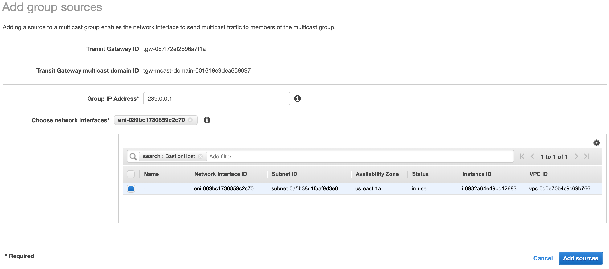
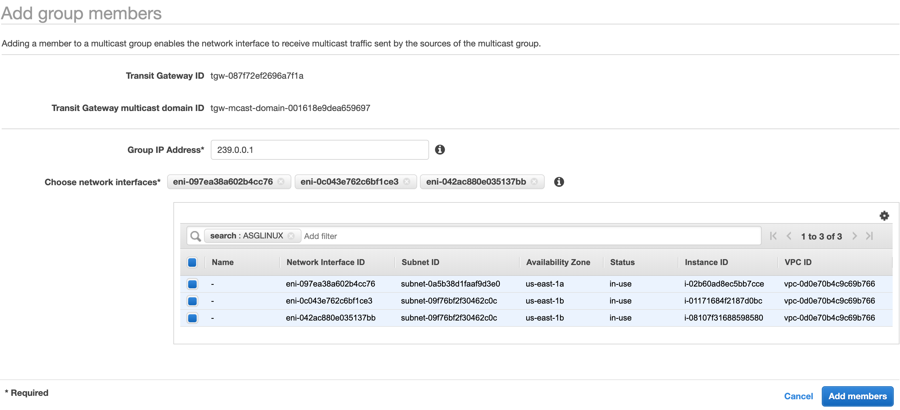
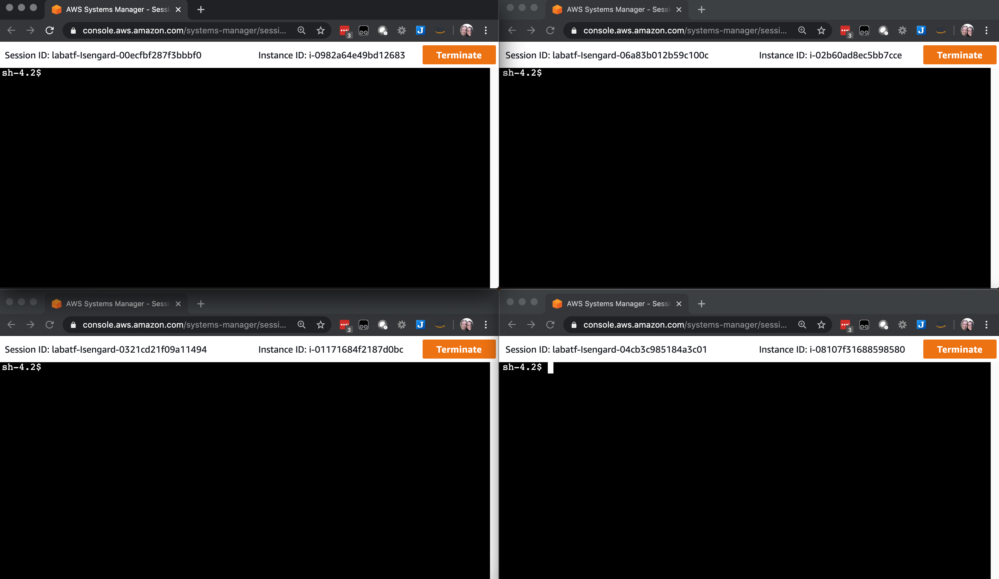

# AWS Transit Gateway Multicast Demo

With this guide you can create an environment for the purposes of demonstrating AWS Transit Gateway Multicast features. The environment will deploy to the `us-east-1` AWS region, and contains the following resources:

* A VPC with public and private subnets across two AZs.
* A Linux Bastion Host, accessible using SSM Session Manager, to be used as the multicast traffic source.
* An AutoScaling Group with 3 instances, accessible using SSM Session Manager and to be used as  multicast traffic receivers.
* A Transit Gateway with Multicast support.
  
## Requirements

* [AWS CDK](https://docs.aws.amazon.com/cdk/latest/guide/getting_started.html)
* [Git Client](https://git-scm.com/)
* [Existing AWS Account](https://aws.amazon.com/premiumsupport/knowledge-center/create-and-activate-aws-account/)
  
## Getting started

From your terminal run the following commands:

```bash
git clone https://github.com/flabat/aws-multicast-demo.git
cd aws-multicast-demo
npm install
cdk deploy
```

Confirm the deployment changes.

CDK will deploy the VPC and instances to your AWS account in the us-east-1 region, the process will take about 10-20 minutes.

## Create a Transit Gateway with Multicast Support

Go to the VPC console, Transit Gateways, and click [Create Transit Gateway](https://console.aws.amazon.com/vpc/home?region=us-east-1#CreateTransitGateway:). Enter a **Name Tag** and **Description**. Select **Multicast Support**.


## Create a Transit Gateway Attachment to the Demo VPC

Go the VPC console, Transit Gateway Attachments and click [Create Transit Gateway Attachment](https://console.aws.amazon.com/vpc/home?region=us-east-1#CreateTgwAttachment:). Select the Transit Gateway you created in the previous step, VPC as the **Attachment Type**, fill **Attachment name tag**, in the **VPC ID** dropdown select the McdemoCdkStack/VPC. Select the two Private Subnets. Click **Create Attachment**.


## Create a Transit Gateway Multicast Domain

Go to the VPC console, Transit Gateway Multicast Domains and click [Create Transit Gateway multicast domain](https://console.aws.amazon.com/vpc/home?region=us-east-1#CreateTransitGatewayMulticastDomain:). Fill the Name tag and select the Transit Gateway you created above. Click **Create Transit Gateway multicast domain**.


## Associate the subnets to the multicast domain

Select the domain you created above, open the **Associations** tab and click **Create Association**. Choose the attachment to associate and select the two private subnets. Click **Create Association**. 


## Add a multicast source

From the [Transit Gateway Mulicast console](https://console.aws.amazon.com/vpc/home?region=us-east-1#TransitGatewayMulticastDomains:sort=transitGatewayMulticastDomainId), select the multicast domain you created earlier. Click the **Groups** tab and click **Add source**. Enter `239.0.0.1` in the **Group IP Address** field. In the **Choose network interfaces** filter field type `BastionHost`, select  the ENI. Click the **Add sources** button to complete the operation.



## Add multicast members

From the [Transit Gateway Mulicast console](https://console.aws.amazon.com/vpc/home?region=us-east-1#TransitGatewayMulticastDomains:sort=transitGatewayMulticastDomainId), select the multicast domain you created earlier. Click the **Groups** tab and click **Add member**. Enter `239.0.0.1` in the **Group IP Address** field. In the **Choose network interfaces** filter field type `ASGLINUX` (these are the instances in the Autoscaling group), select all thhe ENIs. Click the **Add Members** button to complete the operation.



## Start terminal sessions to the source and member instances

Now that you have a one source and multiple members, you will use `iperf`, `omping`, and a Python sample application to test connectivity and bandwidth between the EC2 instances in the multicast domain.

Open the EC2 console, select the [BastionHost instance](https://console.aws.amazon.com/ec2/v2/home?region=us-east-1#Instances:search=BastionHost;sort=instanceState) and click **Connect**. For Connection method, select **Session Manager** and click **Connect**. Leave this session tab open.

Open the EC2 console, select the [McdemoCdkStack/ASGLINUX](https://console.aws.amazon.com/ec2/v2/home?region=us-east-1#Instances:search=BastionHost;sort=instanceState) one at the time and click **Connect**. For Connection method, select **Session Manager** and click **Connect**. Leave these sessions tabs open.

You should now have four browser windows/tabs with sessions established to the source and member instances.



## Test multicast connectivity using `iperf`

Start `iperf` servers in each of the instances part of the Autoscaling Group, these are the instances that will receive traffic from the source (BastionHost). Use the command below to listen for UDP multicast traffic on the group address `239.0.0.1`

`iperf -s -u -B 239.0.0.1`

Start an `iperf` client in the BastionHost (source) instance. Use the command below to send UDP multicast traffic to the group address `239.0.0.1`

`iperf -u -c 239.0.0.1`

You can also add parameters to `iperf` to create parallel connections, how long the test will run for, and how much bandwidth per connection to use. The command below will create a client with 10 connections, for 30 seconds, and 1Gb/s per connection.

`iperf -u -c 239.0.0.1 -t 30 -P 10 -b 1G`

To stop the `iperf` servers press CTRL+C twice.

## Test multicast connectivity using Python

The instances contain two Python scripts, a sender script to run in the BastionHost and a receiver script to run in the AutoScaling instances.

In the Autoscaling group instances (receivers) terminal sessions, execute the following:

`python /opt/mcreceiver.py`

In the BastionHost instance (sender) terminal session, execute the following to send one message to the receivers:

`python /opt/mcsender.py`

To send one message every one second continuously, you can use the following one liner:

`while true; do python /opt/mcsender.py; sleep 1; done;`

To stop the python scripts  press CTRL+C.

## Test multicast connectivity using `omping`

The `omping`  tool needs the IP addresses of the instances you want to test connectivity, replace the 10.99.x.x addresses in the command below with your own and run the command on all terminal sessions starting with the BastionHost:

`omping -m 239.0.0.1 -p 1234 10.99.x.x 10.99.x.x 10.99.x.x 10.99.x.x`

For example, in my environment the command is: `omping -m 239.0.0.1 -p 1234 10.99.169.17 10.99.147.76 10.99.195.70 10.99.248.153`

You should see unicast responses in all instances from the other instances, but multicast responses only in the receiver instances.

## Clean up

* Delete all the subnet associations from the [Multicast domain](https://console.aws.amazon.com/vpc/home?region=us-east-1#TransitGatewayMulticastDomains:sort=transitGatewayMulticastDomainId).
* Delete the VPC attachment from the [Transit Gateway Attachments](https://console.aws.amazon.com/vpc/home?region=us-east-1#TransitGatewayAttachments:sort=transitGatewayAttachmentId) console.
* Delete the Transit Gateway from the [Transit Gateways](https://console.aws.amazon.com/vpc/home?region=us-east-1#TransitGateways:sort=transitGatewayId) console.
* Run `cdk destroy` from your terminal in the folder you cloned this repo.
