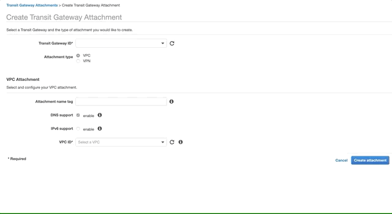
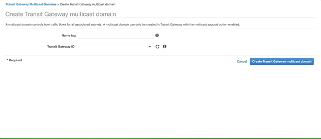
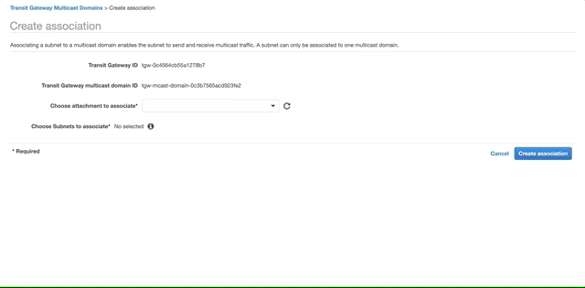

# AWS Transit Gateway Multicast Demo

## Getting started

TODO Bootstrap demo env with CDK

## Create a Transit Gateway with Multicast Support

Go to the VPC console, Transit Gateways, and click [Create Transit Gateway](https://console.aws.amazon.com/vpc/home?region=us-east-1#CreateTransitGateway:). Enter a **Name Tag** and **Description**. Select **Multicast Support**.

## Create a Transit Gateway Attachment to the Demo VPC

Go the VPC console, Transit Gateway Attachments and click [Create Transit Gateway Attachment](https://console.aws.amazon.com/vpc/home?region=us-east-1#CreateTgwAttachment:). Select the Transit Gateway you created in the previous step, VPC as the **Attachment Type**, fill **Attachment name tag**, in the **VPC ID** dropdown select the McdemoCdkStack/VPC. Select the two Private Subnets. Click **Create Attachment**.

## Create a Transit Gateway Multicast Domain

Go to the VPC console, Transit Gateway Multicast Domains and click [Create Transit Gateway multicast domain](https://console.aws.amazon.com/vpc/home?region=us-east-1#CreateTransitGatewayMulticastDomain:). Fill the Name tag and select the Transit Gateway you created above. Click **Create Transit Gateway multicast domain**.

## Associate the subnets to the multicast domain

Select the domain you created above, open the **Associations** tab and click **Create Association**. Choose the attachment to associate and select the two private subnets. Click **Create Association**. 

## Add a multicast source

TODO

## Add multicast members

TODO

## Test using iperf

TODO

## Test using omping

TODO

